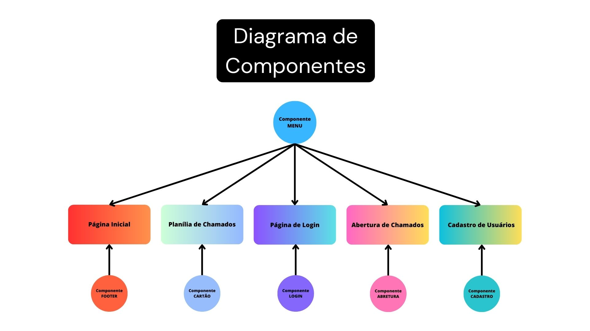

# TUBARÃO DOENTE

# [Link Códigos](https://github.com/gvfirmeza/react-tubaraodoente.git)

# [Link da Apresentação](https://docs.google.com/presentation/d/1qOLT8aC6oTGKS39WKmboXl9iqYmYdjJyvIbx_SoNAJA/edit#slide=id.g251a2305cec_0_1)

## Missão
- Criação de um sistema para abertura e gerenciamento de chamados.
## Cliente
- Empresa de área tecnológica destinada para área industrial.
## Requisitos Funcionais
- O sistema deve monitorar em tempo real a quantidade de chamados recebidos pela empresa.
- O sistema deve exibir os chamados abertos e sua situação atual.
- O sistema deve fazer a contagem dos chamados resolvidos.
- O sistema deve classificar os chamados de acordo com sua urgência ou prioridade.
- O sistema deve ter recursos de login para os usuários inserirem nome, número e email para contato, caso necessário.
- O sistema deve captar dados em tempo real para manipulação de máquinas que estejam com mal funcionamento.
- O sistema deve ter login para operacional, administrador e cliente.
- O usuario que entrar como administrador deve  ver apenas a informação do seu  setor.
- O usuario que entrar como adminstrador tera acesso ao  dashboard.
- O usuario que entrar como parte do setor operacional tera acesso apenas ao chamados que esse setor.
- O sistema deve controlar o acesso do usuario.
- o sistema deve definir se os chamados estão abertos, resolvidos ou pendentes.
- o sistema deverá ser capaz de operar em alta carga de chamados sem sair do ar.

## Requisitos Não Funcionais
- O usuário deve ter acesso  ao sistema para fazer o chamado 24 horas 7 dias da semana 
- O sistema deve ter interface de usuário amigável e intuitiva para facilitar a navegação e uso do dashboard.
- O usuário vê apenas o seu próximo chamado.
- O sistema deve ter suporte ao usuário.
- O sistema deve ser eficiente 
- O sistema precisa ser web.

## 5W2H

- O quê?: Fazer um sistema de planejamento e controle de chamados da empresa.
- Quem?: Os usuários que desejarem abrir chamados, tanto clientes como trabalhadores da própria empresa.
- Quando?: Projeto deverá ser finalizado junto com o primeiro semestre de 2023.
- Onde?: O sistema deverá rodar em WEB, com porte para navegadores Desktop e Mobile.
- Por quê?: O sistema servirá para facilitar a empresa de controlar tais informações, economizando tempo e os deixando mais organizados.
- Como?: O sistema irá controlar a quantidade de chamados e os seus status (abertos, resolvidos, urgentes) e representar tais dados no Dashboard.
- Quanto?: Esforço e dedicação do time.

# Rascunho do Site:

## Janela para Usuários Logarem e Enviarem os Chamados 
  

### Ator:
- Usuário
### Casos de Uso:
- Se Registrar
- Fazer Login
- Preencher informações do chamado
- Enviar chamado
### Fluxo de Eventos:
1. O Usuário irá se registrar.
2. Após se registar o Usuário deverá efetuar o login.
3. Já logado, o Usuário poderá prencher as informações do chamado.
4. Após preencher o Usuário deverá clicar para enviar e o chamado será enviado.
### Exceções:
- Se o usuário tentar enviar o chamado sem preencher as informações obrigatórias, o sistema exibirá uma mensagem indicando os campos que faltam ser preenchidos.
- Se o usuário tentar enviar o chamado sem estar logado, o sistema o redicionará para a página de login.

## Janela para Funcionários Acompanharem os Chamados  

### Ator:
- Funcionários
### Casos de Uso:
- Fazer Login como funcionário
- Acessar o menu de chamados
- Verificar chamados em aberto
- Checar nivel de urgência dos chamados
- Resolver chamados
### Fluxo de Eventos:
1. O Funcionário receberá as informações de login 
2. O Funcionário irá realizar o login
3. O Funcionário será redirecionado para a página de chamados
4. O Funcionário terá acesso a todas as informações sobre os chamados
5. O Funcionário poderá resolver os chamados
### Exceções:
- Se o funcionário tentar resolver um chamado já expirado ou já resolvido, o sistema irá exibir uma mensagem de erro.
## Janela para Administradores Acompanharem Dashboard  

### Ator:
- Administradores 
### Casos de Uso:
- Fazer Login como Administrador
- Acessar a Dashboard de Informações sobre os Chamados
### Fluxo de Eventos:
1. O Administrador receberá as informações de login 
2. O Administrador irá realizar o login
3. O Administrador será redirecionado para a página do Dashboard
4. O Administrador terá acesso a todas as informações presente no Dashboard

## Diagrama de Componentes

